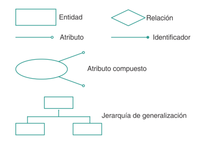

# Modelo Entidad–Relación (ER) Simple

Elementos básicos:

- **Entidades**: objetos del mundo real (ej. Cliente, Producto).
- **Atributos**: propiedades de las entidades (ej. nombre, precio).
- **Relaciones**: vínculos entre entidades (ej. Cliente compra Producto).
- **Cardinalidad**: número de ocurrencias relacionadas (1:1, 1:N, N:M).

El modelo ER simple es la base para representar información de forma clara.

Ejemplo de modelo ER simple

```
[Cliente] ---- (Compra) ---- [Producto]
   |                           |
 nombre                        precio
 dirección                     stock


```

