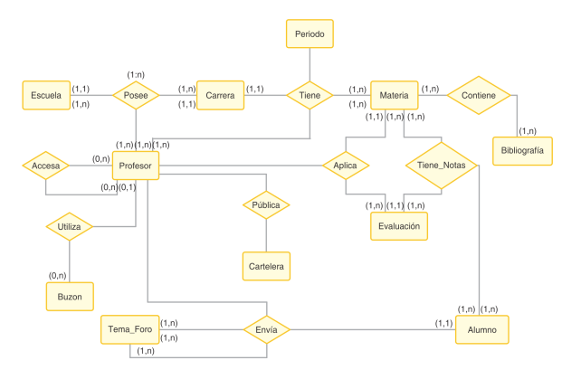

# Modelo Entidad–Relación (ER) Extendido

Incluye elementos avanzados:

- **Entidades débiles**: dependen de otra entidad (ej. DetallePedido).
- **Generalización/Especialización**: jerarquías (ej. Empleado puede ser Profesor o Administrativo).
- **Atributos multivalorados**: un atributo con varios valores posibles (ej. Teléfono de un Cliente).
- **Relaciones ternarias**: involucran tres entidades.

El ER extendido permite representar escenarios más complejos de la realidad.

Ejemplo de modelo ER extendido

```
[Pedido] ----< Contiene >---- [DetallePedido] (Entidad débil)
                                 cantidad

[Empleado]
     |
     +-- [Profesor]
     |
     +-- [Administrativo]
```



