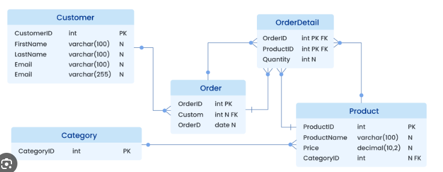

# Introducción al Modelo Relacional

- Propuesto por E.F. Codd en 1970.
- Representa datos en **tablas** (relaciones).
- Conceptos clave:
  - **Tupla**: fila de la tabla.
  - **Atributo**: columna de la tabla.
  - **Clave primaria**: identifica de manera única cada tupla.
  - **Clave foránea**: conecta una tabla con otra.
- Una relación N:M se representa con una **tabla intermedia**.

Es el modelo más usado en sistemas actuales y base de SQL.

