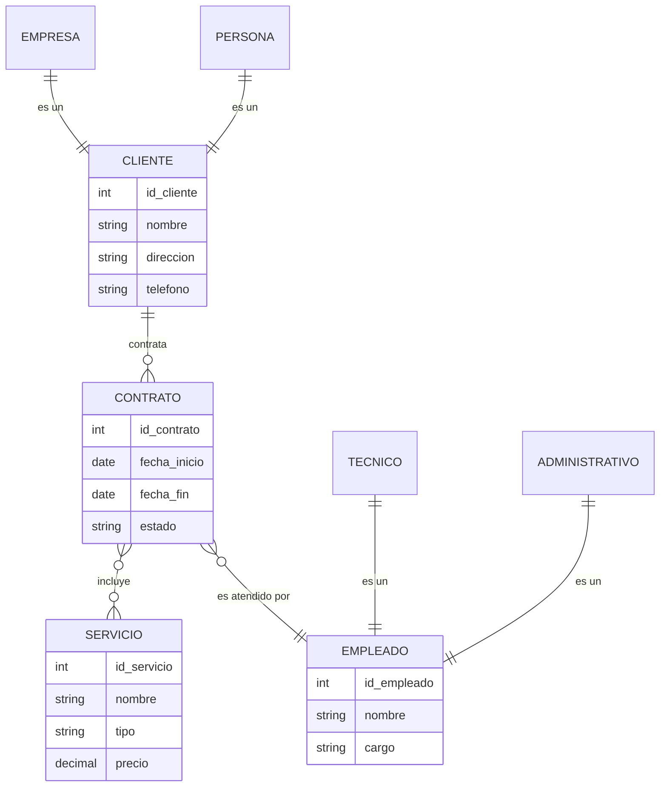

# DER Conceptual

```mermaid
erDiagram
    CLIENTE ||--o{ CONTRATO : "contrata"
    CONTRATO }o--|| EMPLEADO : "es atendido por"
    CONTRATO }o--o{ SERVICIO : "incluye"

    CLIENTE {
        int id_cliente
        string nombre
        string direccion
        string telefono
    }

    PERSONA ||--|| CLIENTE : "es un"
    EMPRESA ||--|| CLIENTE : "es un"

    EMPLEADO {
        int id_empleado
        string nombre
        string cargo
    }

    TECNICO ||--|| EMPLEADO : "es un"
    ADMINISTRATIVO ||--|| EMPLEADO : "es un"

    SERVICIO {
        int id_servicio
        string nombre
        string tipo
        decimal precio
    }

    CONTRATO {
        int id_contrato
        date fecha_inicio
        date fecha_fin
        string estado
    }
```

