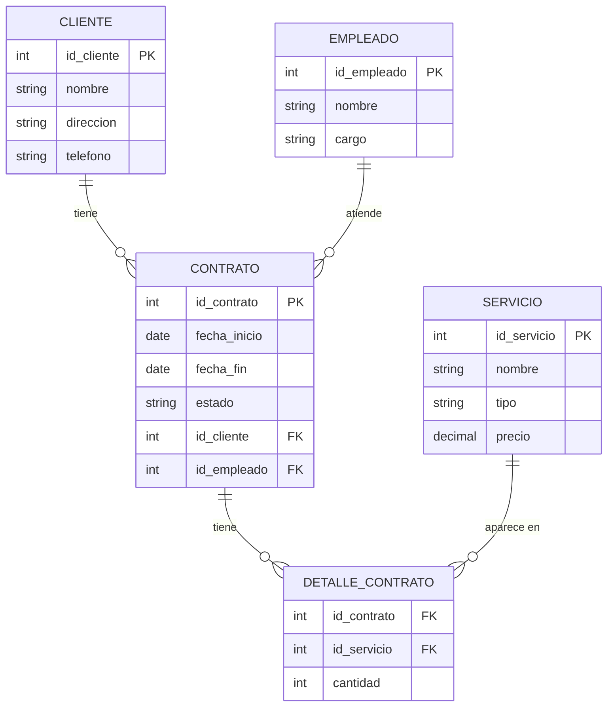

# 📊 DER Físico (Modelo Relacional) en Mermaid

---

### 🔑 Explicación de la Transformación

1. **Jerarquías eliminadas:**
   
   - `Persona` y `Empresa` → se representarán como columnas opcionales o como una tabla extendida según el enfoque (Single Table Inheritance o varias tablas).
   - `Técnico` y `Administrativo` → igual, se pueden manejar con un atributo `tipo_empleado` + columnas opcionales, o tablas separadas.
2. **Relación N:M entre Contrato y Servicio:**
   
   - Se creó la tabla intermedia **DETALLE_CONTRATO** con **FK a Contrato y Servicio**, más el atributo `cantidad`.
3. **Claves foráneas en CONTRATO:**
   
   - `id_cliente` para ligar con CLIENTE.
   - `id_empleado` para ligar con EMPLEADO.
4. **Relaciones renombradas** para indicar acción desde la perspectiva física:
   
   - Cliente → Contrato = "tiene"
   - Empleado → Contrato = "atiende"

