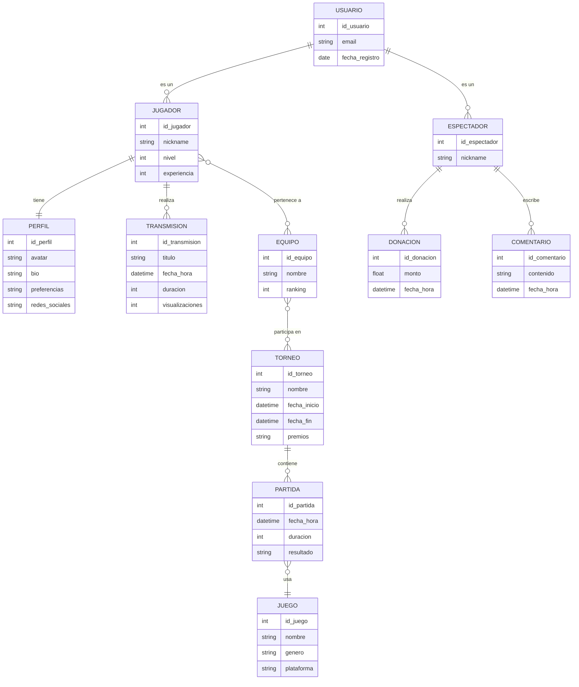

# DER Conceptual


```mermaid
erDiagram
USUARIO ||--o{ JUGADOR : "es un"
USUARIO ||--o{ ESPECTADOR : "es un"
JUGADOR ||--|| PERFIL : "tiene"
JUGADOR ||--o{ TRANSMISION : "realiza"
JUGADOR }o--o{ EQUIPO : "pertenece a"
EQUIPO }o--o{ TORNEO : "participa en"
TORNEO ||--o{ PARTIDA : "contiene"
PARTIDA }o--|| JUEGO : "usa"
ESPECTADOR ||--o{ DONACION : "realiza"
ESPECTADOR ||--o{ COMENTARIO : "escribe"

USUARIO {
int id_usuario
string email
date fecha_registro
}

JUGADOR {
int id_jugador
string nickname
int nivel
int experiencia
}

ESPECTADOR {
int id_espectador
string nickname
}

PERFIL {
int id_perfil
string avatar
string bio
string preferencias
string redes_sociales
}

TRANSMISION {
int id_transmision
string titulo
datetime fecha_hora
int duracion
int visualizaciones
}

EQUIPO {
int id_equipo
string nombre
int ranking
}

TORNEO {
int id_torneo
string nombre
datetime fecha_inicio
datetime fecha_fin
string premios
}

PARTIDA {
int id_partida
datetime fecha_hora
int duracion
string resultado
}

JUEGO {
int id_juego
string nombre
string genero
string plataforma
}

DONACION {
int id_donacion
float monto
datetime fecha_hora
}

COMENTARIO {
int id_comentario
string contenido
datetime fecha_hora
}
```

```

```

