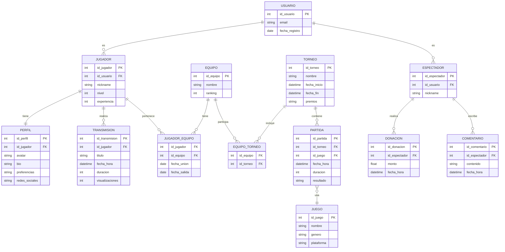

# DER Físico (Modelo Relacional) – Plataforma de Torneos

---

### Transformación

**Subtipos resueltos como tablas hijas**

- `JUGADOR` y `ESPECTADOR` tienen FK a `USUARIO`.
- Esto preserva la herencia y permite datos específicos de cada subtipo.

**Relaciones N:M convertidas en tablas intermedias:**

- `JUGADOR` ↔ `EQUIPO` → `JUGADOR_EQUIPO`
- `EQUIPO` ↔ `TORNEO` → `EQUIPO_TORNEO`

**Relaciones 1:N como FK:**

- `TRANSMISION.id_jugador`
- `PERFIL.id_jugador`
- `DONACION.id_espectador`
- `COMENTARIO.id_espectador`

**Integridad referencial explícita:**
Todas las tablas con FK están claramente ligadas a su tabla padre.

