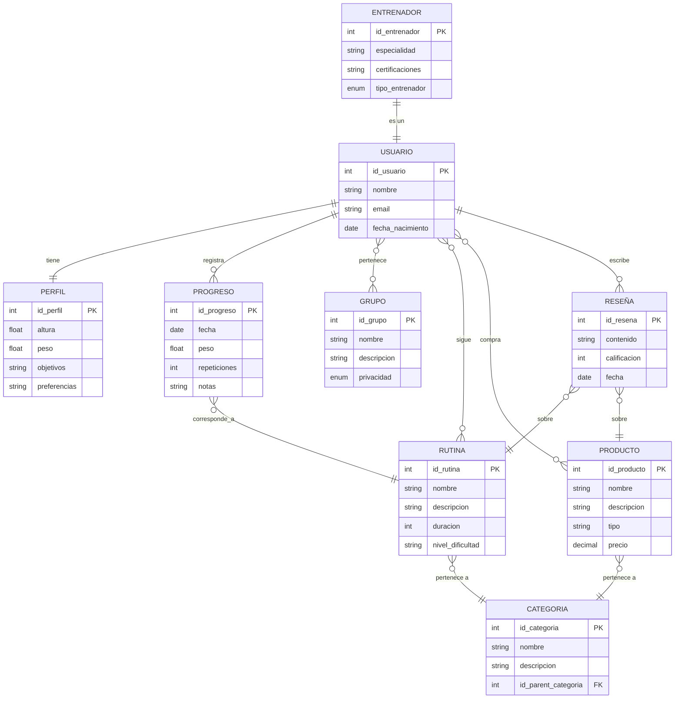

# DER Conceptual

```mermaid
erDiagram
    %% === ENTIDADES ===
    USUARIO ||--|| PERFIL : "tiene"
    USUARIO ||--o{ PROGRESO : "registra"
    USUARIO }o--o{ GRUPO : "pertenece"
    USUARIO }o--o{ RUTINA : "sigue"
    USUARIO }o--o{ PRODUCTO : "compra"
    USUARIO ||--o{ RESEÑA : "escribe"

    ENTRENADOR ||--|| USUARIO : "es un"

    RUTINA }o--|| CATEGORIA : "pertenece a"
    PRODUCTO }o--|| CATEGORIA : "pertenece a"

    RESEÑA }o--|| RUTINA : "sobre "
    RESEÑA }o--|| PRODUCTO : "sobre "
    PROGRESO }o--|| RUTINA : "corresponde_a"

    %% === ATRIBUTOS PRINCIPALES ===
    USUARIO {
        int id_usuario PK
        string nombre
        string email
        date fecha_nacimiento
    }

    PERFIL {
        int id_perfil PK
        float altura
        float peso
        string objetivos
        string preferencias
    }

    ENTRENADOR {
        int id_entrenador PK
        string especialidad
        string certificaciones
        enum tipo_entrenador
    }

    RUTINA {
        int id_rutina PK
        string nombre
        string descripcion
        int duracion
        string nivel_dificultad
    }

    PROGRESO {
        int id_progreso PK
        date fecha
        float peso
        int repeticiones
        string notas
    }

    PRODUCTO {
        int id_producto PK
        string nombre
        string descripcion
        string tipo
        decimal precio
    }

    CATEGORIA {
        int id_categoria PK
        string nombre
        string descripcion
        int id_parent_categoria FK
    }

    GRUPO {
        int id_grupo PK
        string nombre
        string descripcion
        enum privacidad
    }

    RESEÑA {
        int id_resena PK
        string contenido
        int calificacion
        date fecha
        %% NOTA: debe referenciar exactamente a un producto O una rutina
    }
```

