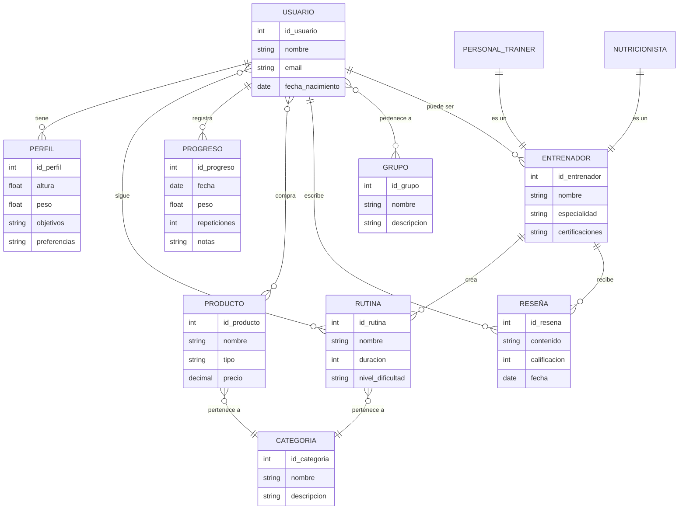

# DER Conceptual

```mermaid
erDiagram
USUARIO ||--o{ PERFIL : "tiene"
USUARIO }o--o{ RUTINA : "sigue"
ENTRENADOR ||--o{ RUTINA : "crea"
USUARIO ||--o{ PROGRESO : "registra"
USUARIO }o--o{ PRODUCTO : "compra"
USUARIO ||--o{ RESEÑA : "escribe"
ENTRENADOR ||--o{ RESEÑA : "recibe"
RUTINA }o--|| CATEGORIA : "pertenece a"
PRODUCTO }o--|| CATEGORIA : "pertenece a"
USUARIO }o--o{ GRUPO : "pertenece a"
USUARIO ||--o{ ENTRENADOR : "puede ser"

USUARIO {
    int id_usuario
    string nombre
    string email
    date fecha_nacimiento
}

ENTRENADOR {
    int id_entrenador
    string nombre
    string especialidad
    string certificaciones
}

PERSONAL_TRAINER ||--|| ENTRENADOR : "es un"
NUTRICIONISTA ||--|| ENTRENADOR : "es un"

PERFIL {
    int id_perfil
    float altura
    float peso
    string objetivos
    string preferencias
}

RUTINA {
    int id_rutina
    string nombre
    int duracion
    string nivel_dificultad
}

PROGRESO {
    int id_progreso
    date fecha
    float peso
    int repeticiones
    string notas
}

PRODUCTO {
    int id_producto
    string nombre
    string tipo
    decimal precio
}

RESEÑA {
    int id_resena
    string contenido
    int calificacion
    date fecha
}

GRUPO {
    int id_grupo
    string nombre
    string descripcion
}

CATEGORIA {
    int id_categoria
    string nombre
    string descripcion
}
```

