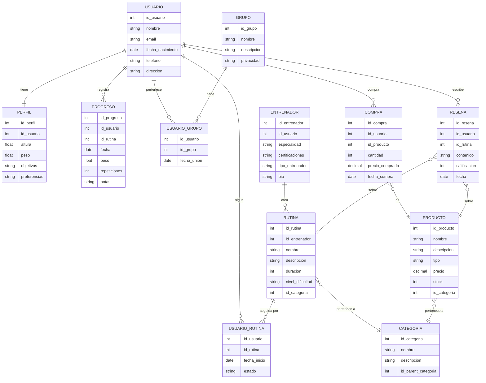

# DER Físico – Plataforma de Fitness

---

### Transformación

**Herencia resuelta con FK:**

- `ENTRENADOR.id_usuario` referencia a `USUARIO`.

**Relaciones N:M resueltas con tablas intermedias:**

- `USUARIO_RUTINA`, `USUARIO_PRODUCTO`, `USUARIO_GRUPO`.
- Cada una incluye FKs + atributos propios (por ejemplo, `fecha_inicio` para saber desde cuándo sigue la rutina).

**Relaciones 1:N:**

- `PERFIL.id_usuario` → un usuario puede tener varios perfiles (o uno según reglas).
- `RUTINA.id_entrenador` → una rutina la crea un entrenador.
- `RESEÑA.id_usuario` y `RESEÑA.id_entrenador` → se puede saber quién escribió y a quién va dirigida.

**CATEGORIA reutilizada**

- Tanto `RUTINA` como `PRODUCTO` se ligan a `CATEGORIA` vía FK → evita duplicar categorías.

**Nutricionista y Personal Trainer como tipo_entrenador**

- El campo  tipo_entrenador incluirá : personal_trainer | nutricionista | otro

