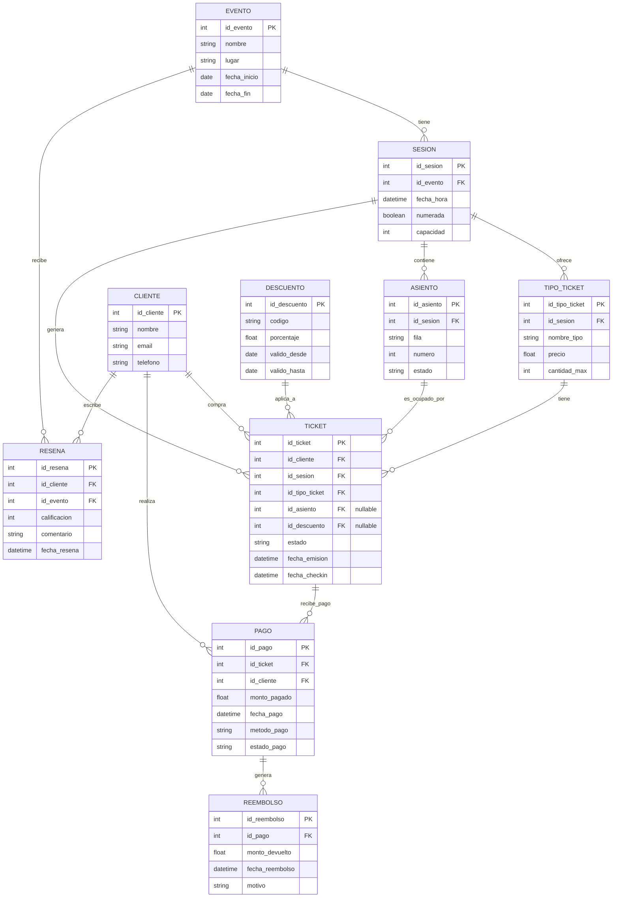

```mermaid
%% 1) Modelo Relacional (MER) completo - erDiagram
erDiagram
    EVENTO ||--o{ SESION : "tiene"
    SESION ||--o{ TIPO_TICKET : "ofrece"
    SESION ||--o{ ASIENTO : "contiene"
    SESION ||--o{ TICKET : "genera"
    CLIENTE ||--o{ TICKET : "compra"
    TIPO_TICKET ||--o{ TICKET : "tiene"
    ASIENTO ||--o{ TICKET : "es_ocupado_por"
    TICKET ||--o{ PAGO : "recibe_pago"
    CLIENTE ||--o{ PAGO : "realiza"
    PAGO ||--o{ REEMBOLSO : "genera"
    DESCUENTO ||--o{ TICKET : "aplica_a"
    CLIENTE ||--o{ RESENA : "escribe"
    EVENTO ||--o{ RESENA : "recibe"

    EVENTO {
        int id_evento PK
        string nombre
        string lugar
        date fecha_inicio
        date fecha_fin
    }

    SESION {
        int id_sesion PK
        int id_evento FK
        datetime fecha_hora
        boolean numerada
        int capacidad
    }

    TIPO_TICKET {
        int id_tipo_ticket PK
        int id_sesion FK
        string nombre_tipo
        float precio
        int cantidad_max
    }

    ASIENTO {
        int id_asiento PK
        int id_sesion FK
        string fila
        int numero
        string estado
    }

    CLIENTE {
        int id_cliente PK
        string nombre
        string email
        string telefono
    }

    TICKET {
        int id_ticket PK
        int id_cliente FK
        int id_sesion FK
        int id_tipo_ticket FK
        int id_asiento FK "nullable"
        int id_descuento FK "nullable"
        string estado
        datetime fecha_emision
        datetime fecha_checkin
    }

    DESCUENTO {
        int id_descuento PK
        string codigo
        float porcentaje
        date valido_desde
        date valido_hasta
    }

    PAGO {
        int id_pago PK
        int id_ticket FK
        int id_cliente FK
        float monto_pagado
        datetime fecha_pago
        string metodo_pago
        string estado_pago
    }

    REEMBOLSO {
        int id_reembolso PK
        int id_pago FK
        float monto_devuelto
        datetime fecha_reembolso
        string motivo
    }

    RESENA {
        int id_resena PK
        int id_cliente FK
        int id_evento FK
        int calificacion
        string comentario
        datetime fecha_resena
    }

```

